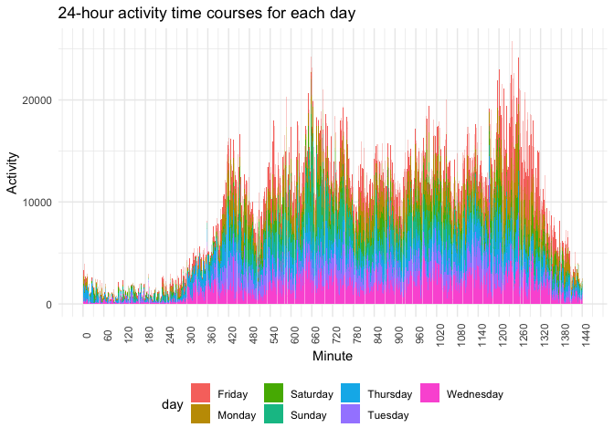

p8105_hw3_jm5509
================
Echo
2022-10-15

## Problem 1

This problem uses the Instacart data.The goal is to do some exploration
of this dataset. How many aisles are there, and which aisles are the
most items ordered from?

``` r
data("instacart")
(instacart %>% group_by(aisle) %>% count() %>% nrow())
```

    ## [1] 134

``` r
(instacart %>% group_by(aisle_id) %>% count() %>% nrow())
```

    ## [1] 134

Make a plot that shows the number of items ordered in each aisle,
limiting this to aisles with more than 10000 items ordered. Arrange
aisles sensibly, and organize your plot so others can read it.

``` r
instacart %>% group_by(aisle) %>% 
  summarize(n_ordered = n()) %>% 
  filter(n_ordered > 10000) %>% 
  arrange(desc(n_ordered)) %>% 
  mutate(aisle = fct_reorder(aisle, n_ordered)) %>% 
  ggplot(aes(y=aisle, x= n_ordered, fill=aisle))+
  geom_col()+
  labs(
     title = "Number of items ordered in every aisle",
      x = "Aisle",
      y = "Number of items ordered") +
  theme(legend.position = "none")
```

<!-- -->
Make a table showing the three most popular items in each of the aisles
“baking ingredients”, “dog food care”, and “packaged vegetables fruits”.
Include the number of times each item is ordered in your table.

``` r
instacart %>% 
  filter(aisle == c('baking ingredients', 
                    'dog food care', 'packaged vegetables fruits')) %>%
  group_by(aisle, product_name) %>% 
  summarize(n_product = n()) %>% 
  filter(min_rank(desc(n_product)) <= 3) %>% 
  knitr::kable()
```

    ## `summarise()` has grouped output by 'aisle'. You can override using the
    ## `.groups` argument.

| aisle                      | product_name                                    | n_product |
|:---------------------------|:------------------------------------------------|----------:|
| baking ingredients         | Light Brown Sugar                               |       157 |
| baking ingredients         | Organic Vanilla Extract                         |       122 |
| baking ingredients         | Pure Baking Soda                                |       140 |
| dog food care              | Organix Chicken & Brown Rice Recipe             |        13 |
| dog food care              | Organix Grain Free Chicken & Vegetable Dog Food |        14 |
| dog food care              | Original Dry Dog                                |         9 |
| packaged vegetables fruits | Organic Baby Spinach                            |      3324 |
| packaged vegetables fruits | Organic Blueberries                             |      1692 |
| packaged vegetables fruits | Organic Raspberries                             |      1920 |

As is shown above, the top 3 baking ingredients are `light brown sugar`,
`organic vanilla extract`, and `pure baking soda`; the top 3 dog food
cares are `Organix Chicken & Brown Rice Recipe`,
`Organix Grain Free Chicken & Vegetable Dog Food`, and
`Original Dry Dog`; the top 3 packaged vegetables fruits are
`Organic Baby Spinach`, `Organic Blueberries`, `Organic Raspberries`.
Comparing the sales volumes, the `packaged vegetables fruits` category
is the most popular one among the three.

Finally, for each day of the week, a table shows the average hour of the
day when Pink Lady Apples and Coffee Ice Cream are ordered. For human
readers, this table has been structured in an untidy manner. With the
exception of day 5, Pink Lady Apples are normally purchased
significantly earlier in the day than Coffee Ice Cream.

``` r
instacart %>% 
  filter(product_name == c('Pink Lady Apples','Coffee Ice Cream')) %>% 
  group_by(product_name, order_dow) %>% 
  summarize(
    mean_order_hour = mean(order_hour_of_day)
  ) %>% 
  mutate(order_dow = recode(order_dow, `0` = 'Sunday', `1` =' Monday',
                            `2` = 'Tuesday', `3` = 'Wednesday',
                            `4` = 'Thursday', `5` = 'Friday',
                            `6` = 'Saturday')) %>% 
  pivot_wider(names_from = order_dow, values_from = mean_order_hour) %>% 
  knitr::kable()
```

    ## Warning in product_name == c("Pink Lady Apples", "Coffee Ice Cream"): longer
    ## object length is not a multiple of shorter object length

    ## `summarise()` has grouped output by 'product_name'. You can override using the
    ## `.groups` argument.

| product_name     |   Sunday |   Monday |  Tuesday | Wednesday | Thursday |   Friday | Saturday |
|:-----------------|---------:|---------:|---------:|----------:|---------:|---------:|---------:|
| Coffee Ice Cream | 13.22222 | 15.00000 | 15.33333 |   15.4000 | 15.16667 | 10.33333 | 12.35294 |
| Pink Lady Apples | 12.25000 | 11.67857 | 12.00000 |   13.9375 | 11.90909 | 13.86957 | 11.55556 |

## Problem 2

This question is about dealing with the accelerometers data. I would
read the data first, and tidying it by adding one a weekday vs weekend
variable, and changing the variables of activity every minute into
observations by *pivot_longer()* function. In this case this dataframe
would have useful names.

``` r
(accel_df <- read_csv('accel_data.csv') %>% 
  janitor::clean_names() %>% 
  rename_with(~str_replace(., regex('^activity_'),'')) %>% 
  mutate(weekday_vs_weekend =
           ifelse(day %in% c('Monday', 'Tuesday', 'Wednesday',
                             'Thursday', 'Friday'), 'weekday', 'weekend')) %>% 
  pivot_longer('1':'1440', names_to = 'minute', values_to = 'activity') %>% 
  mutate(minute = as.integer(minute)) 
 )
```

    ## Rows: 35 Columns: 1443
    ## ── Column specification ────────────────────────────────────────────────────────
    ## Delimiter: ","
    ## chr    (1): day
    ## dbl (1442): week, day_id, activity.1, activity.2, activity.3, activity.4, ac...
    ## 
    ## ℹ Use `spec()` to retrieve the full column specification for this data.
    ## ℹ Specify the column types or set `show_col_types = FALSE` to quiet this message.

    ## # A tibble: 50,400 × 6
    ##     week day_id day    weekday_vs_weekend minute activity
    ##    <dbl>  <dbl> <chr>  <chr>               <int>    <dbl>
    ##  1     1      1 Friday weekday                 1     88.4
    ##  2     1      1 Friday weekday                 2     82.2
    ##  3     1      1 Friday weekday                 3     64.4
    ##  4     1      1 Friday weekday                 4     70.0
    ##  5     1      1 Friday weekday                 5     75.0
    ##  6     1      1 Friday weekday                 6     66.3
    ##  7     1      1 Friday weekday                 7     53.8
    ##  8     1      1 Friday weekday                 8     47.8
    ##  9     1      1 Friday weekday                 9     55.5
    ## 10     1      1 Friday weekday                10     43.0
    ## # … with 50,390 more rows

This produces a dataframe with **50400** observations and **6**
variables. The variables are **week, day_id, day, weekday_vs_weekend,
minute, activity**.

To better use the activity data, we can aggregate across minutes to
create a total activity variable for each day. Then I plot these
activity per day to see if there is an activity trend.

``` r
accel_df %>% group_by(week, day_id, day) %>% 
  summarize(total_activity = sum(activity))
```

    ## `summarise()` has grouped output by 'week', 'day_id'. You can override using
    ## the `.groups` argument.

    ## # A tibble: 35 × 4
    ## # Groups:   week, day_id [35]
    ##     week day_id day       total_activity
    ##    <dbl>  <dbl> <chr>              <dbl>
    ##  1     1      1 Friday           480543.
    ##  2     1      2 Monday            78828.
    ##  3     1      3 Saturday         376254 
    ##  4     1      4 Sunday           631105 
    ##  5     1      5 Thursday         355924.
    ##  6     1      6 Tuesday          307094.
    ##  7     1      7 Wednesday        340115.
    ##  8     2      8 Friday           568839 
    ##  9     2      9 Monday           295431 
    ## 10     2     10 Saturday         607175 
    ## # … with 25 more rows

``` r
accel_df %>% group_by(week, day_id, day) %>% 
  summarize(total_activity = sum(activity)) %>% 
  ggplot(aes(x=day, y = total_activity, fill = week)) +
  geom_col(position = 'dodge2') +
  labs(
     title = "Trends of a total activity for each day",
      x = "Day",
      y = "Activity") 
```

    ## `summarise()` has grouped output by 'week', 'day_id'. You can override using
    ## the `.groups` argument.

<!-- -->

``` r
accel_df %>% group_by(week, day_id, day) %>% 
  summarize(total_activity = sum(activity)) %>% 
  ggplot(aes(x=day_id, y = total_activity, color = day))+
  geom_point()+geom_line()
```

    ## `summarise()` has grouped output by 'week', 'day_id'. You can override using
    ## the `.groups` argument.

<!-- -->

From the column chart and the line chart above, there is no apparent
within-week and between-week trend. However, there are some outliers
that the last two Saturdays’ activities are obviously lower than any
other days, which is 1440. Both the within-week and the between-week
activity vary a lot.

I would make a single-panel plot that shows the 24-hour activity time
courses for each day and use color to indicate day of the week.

``` r
accel_df %>% 
  ggplot(aes(x=minute, y = activity, fill = day))+
  geom_bar(stat = 'identity')+
  scale_x_continuous(breaks = seq(0,1440, 60)) + 
  theme(axis.text.x = element_text(angle = 90)) +
  labs(
     title = "24-hour activity time courses for each day",
      x = "Minute",
      y = "Activity") 
```

<!-- -->

From this panel, we can see that the activity tend do be higher in
Fridays and Mondays, and lower on Wednesdays and Tuesdays. During the
one-day period, the activity tend to be higher after 7:00 am.(Suppose
that it’s because the subject is at sleep.) The activity peak is at
around 11:00 and 20:00.

## Problem 3

The following code was used to acquire the five core variables for all
New York state weather stations from January 1, 1981 through December
31, 2010. I would first read the data and then do some data cleaning: I
create separate variables for year, month, and day and ensure
observations for temperature, precipitation, and snowfall are given in
reasonable units.

``` r
data('ny_noaa')
(ny_noaa <- ny_noaa %>% 
  separate(date, into = c('year', 'month', 'day'), sep='-') %>% 
  mutate(prcp = prcp/10, tmax = as.numeric(tmax)/ 10, 
         tmin = as.numeric(tmin)/10))
```

    ## # A tibble: 2,595,176 × 9
    ##    id          year  month day    prcp  snow  snwd  tmax  tmin
    ##    <chr>       <chr> <chr> <chr> <dbl> <int> <int> <dbl> <dbl>
    ##  1 US1NYAB0001 2007  11    01       NA    NA    NA    NA    NA
    ##  2 US1NYAB0001 2007  11    02       NA    NA    NA    NA    NA
    ##  3 US1NYAB0001 2007  11    03       NA    NA    NA    NA    NA
    ##  4 US1NYAB0001 2007  11    04       NA    NA    NA    NA    NA
    ##  5 US1NYAB0001 2007  11    05       NA    NA    NA    NA    NA
    ##  6 US1NYAB0001 2007  11    06       NA    NA    NA    NA    NA
    ##  7 US1NYAB0001 2007  11    07       NA    NA    NA    NA    NA
    ##  8 US1NYAB0001 2007  11    08       NA    NA    NA    NA    NA
    ##  9 US1NYAB0001 2007  11    09       NA    NA    NA    NA    NA
    ## 10 US1NYAB0001 2007  11    10       NA    NA    NA    NA    NA
    ## # … with 2,595,166 more rows

The original dataframe has **2595176 observations** and **9 variables**.
The key variables include date(date of observation), prcp(Precipitation
(tenths of mm)), snow(snowfall(mm)), tmax(Maximum temperature (tenths of
degrees C)), tmin(Minimum temperature (tenths of degrees C)). However,
it contains many missing values. There is 145838 missing precipitations,
381221 missing snowfall, 591786 missing snow depth, 1134358 missing
maximum temperature, 1134420 minimum temperature. After dropping all the
missing values, the dataset contains 1222433 observations.
